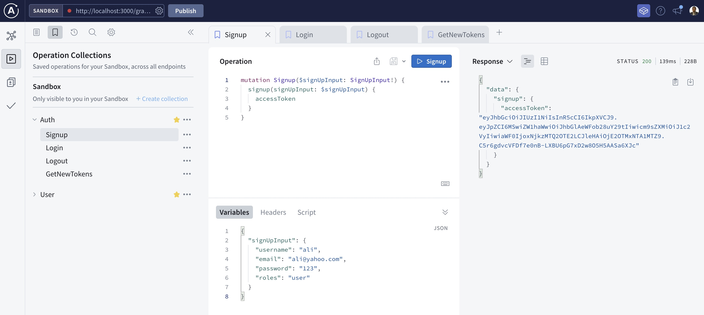

# Node.js recruitment task - senior

This repository contains the base code for recruitment exercise. Complete the tasks listed below and publish the solution on your github. Send us a link to your repository at least 1 day before the interview. We will discuss the proposed solution during the interview. You should be ready to present the working application on your local machine.

There is some key features that must be implemented in the recruitment task:

CRUD operations for customers (get, update, delete) by id or email;

- login and signup operations for customers;
- roles USER and ADMIN;
- access token;
- refresh token;
- restrict access to get customers operation from unauthenticated users;
- restrict access to delete customer and update customer operations from unauthenticated users and customers with USER role;
- ability to verify customer's account after signup with activation code;

## Run application

- `cp example.env .env`
- `docker-compose up -d`
- `npm install`
- `npx prisma migrate dev --name init`
- `npm run start:dev`

## Reset Db

- Run command : `./reset.sh`
  
## Authentication

- Signup
- Login
- Logout
- GetNewToken
  

## User

- CreateUser
- ReadUser
- UpdateUser
- DeleteUser
- ReadAllUsers
- GetActivationCode

